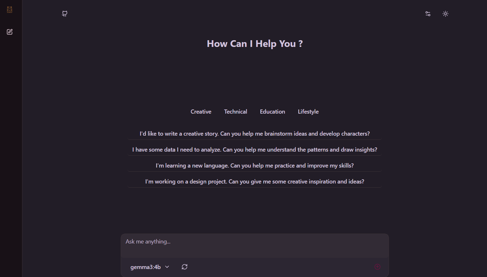

## Local LLaMA – Ollama GUI

An elegant, local-first web UI for chatting with models served by Ollama. This app discovers available models from your running Ollama instance, lets you select one, and chat with streaming responses. Chats are stored locally in your browser using IndexedDB.



### Features

- **Local-first chat**: Connects to a local Ollama server (default `http://localhost:11434`).
- **Streaming responses**: Token-by-token rendering for a responsive chat experience.
- **Model discovery**: Lists models from Ollama and lets you switch quickly.
- **Persistent chat history**: Uses IndexedDB (Dexie) to store chats and messages on-device.
- **Markdown rendering**: Clean formatting with lists, headings, and code blocks.
- **Light/Dark themes**: One-click theme toggle.
- **Keyboard-friendly**: Press Enter to send, Shift+Enter for new line.

### Tech Stack

- **Framework**: Next.js 15 (App Router), React 19
- **Styling/UI**: Tailwind CSS v4, Shadcn
- **Persistence**: Dexie (IndexedDB) with live queries
- **Markdown**: `react-markdown` + `remark-gfm`

---

## Prerequisites

- Node.js ≥ 18.18
- npm (or pnpm/yarn)
- A working Ollama installation and server
  - Install Ollama: see the official docs: [Ollama](https://ollama.com)
  - Start the server: `ollama serve`
  - Pull at least one model, e.g.: `ollama pull llama3.2`

> Note: By default the app connects to `http://localhost:11434`. If your Ollama runs elsewhere, see Configuration below.

---

## Getting Started

1. Install dependencies

```bash
npm install
```

2. Run the dev server

```bash
npm run dev
```

3. Ensure Ollama is running locally

```bash
ollama serve
```

4. Open the app

```
http://localhost:3000
```

You should see the chat interface. Use the model dropdown to select a model detected from your Ollama instance and start chatting.

---

## Build and Run (Production)

```bash
npm run build
npm start
```

---

## Configuration

- **Ollama API base URL**

  - The base URL is currently defined in `src/api/config.ts` as `API_BASE_URL` (default: `http://localhost:11434`).
  - Change this if your Ollama instance runs remotely or on a different port.

- **Settings dialog (UI)**
  - The top-right settings dialog (gear icon) allows entering a Base URL and System Prompt which are stored in IndexedDB for future use. The request layer currently reads from `API_BASE_URL` in code; if you point the app at a non-default Ollama instance, update `src/api/config.ts` accordingly.

---

## Contributing

1. Fork and clone the repo
2. Create a feature branch
3. Make changes with clear, readable code and add tests where applicable
4. Run `npm run lint` and ensure the app builds
5. Open a pull request with a concise description and screenshots if relevant

---
